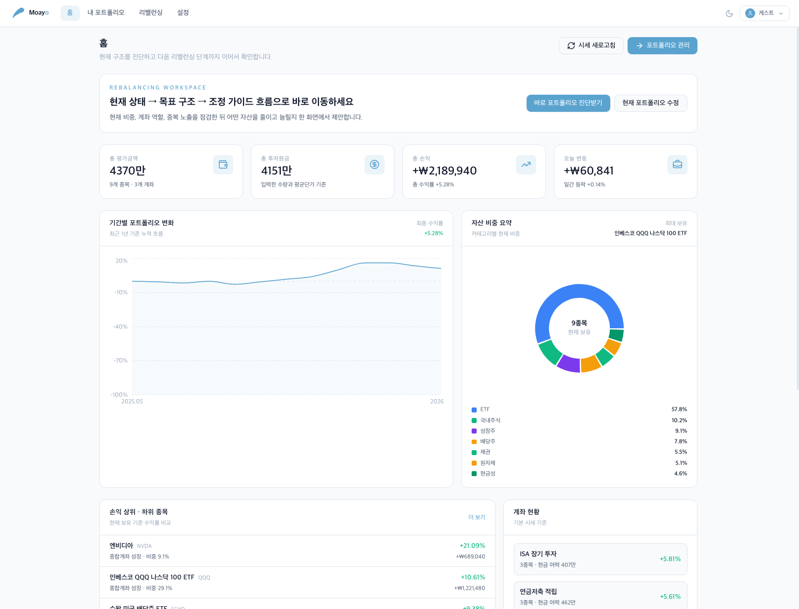
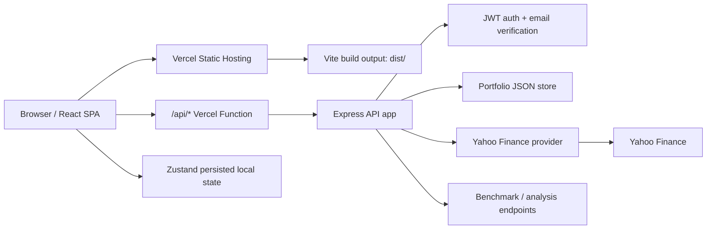

# Moayo - 투자자를 위한 스마트 포트폴리오 플랫폼

ISA, 연금저축, IRP, 종합위탁, CMA 계좌를 하나의 대시보드에서 관리하고 포트폴리오 진단, 세금 최적화, 리밸런싱 가이드를 확인할 수 있는 웹앱입니다.

## 배포

- Production: [https://moayo-smartportfolio.vercel.app](https://moayo-smartportfolio.vercel.app)
- API Health Check: [https://moayo-smartportfolio.vercel.app/api/health](https://moayo-smartportfolio.vercel.app/api/health)

## 실행 화면

### 1. 랜딩 화면


첫 화면에서는 서비스의 핵심 흐름인 `포트폴리오 진단 -> 목표 구조 확인 -> 조정 가이드`를 바로 이해할 수 있게 구성했습니다. 로그인 없이도 게스트 모드로 진단 화면을 체험할 수 있고, 지원 계좌 유형과 백테스팅 기간 같은 주요 신뢰 지표를 첫 화면에 배치했습니다.

### 2. 홈 대시보드



홈 대시보드는 총 평가금액, 투자원금, 손익, 일간 변동을 요약하고, 기간별 성과 흐름과 자산군 비중을 한 화면에서 비교하도록 구성했습니다. 샘플 포트폴리오를 불러오면 보유 종목, 계좌 현황, 리밸런싱 진입 동선까지 바로 확인할 수 있습니다.

## 주요 기능

- **포트폴리오 통합 관리**: ISA, 연금저축, IRP, 종합위탁, CMA, 금현물 계좌 지원
- **실시간/기본 시세 조회**: Yahoo Finance 기반 시세 API와 목데이터 fallback
- **자산 배분 분석**: 자산군, 지역, 종목 집중도 기반 리스크 진단
- **세금 최적화**: ISA 비과세, 해외주식 양도세, 연금계좌 특성을 반영한 분석
- **리밸런싱 가이드**: 현재 구조와 목표 비중을 비교해 조정 방향 제안
- **백테스팅**: S&P 500, 글로벌 시장, 올웨더 벤치마크와 성과 비교
- **인증**: 이메일/JWT 기반 인증, Google/Kakao OAuth 확장 지점 포함

## 아키텍처



### 배포 구조

- `src/`: React 18 + Vite 프론트엔드
- `server/server.js`: Express API 앱. 로컬에서는 HTTP/WebSocket 서버로 실행되고, Vercel에서는 서버리스 함수로 import됩니다.
- `api/[...path].js`: Vercel의 `/api/*` 요청을 Express 앱으로 연결하는 catch-all 함수입니다.
- `vercel.json`: Vite 빌드, API 함수 포함 파일, SPA fallback rewrite를 정의합니다.
- `docs/screenshots/`: GitHub README에 표시되는 실행 화면 이미지입니다.

### 데이터 저장 방식

현재 포트폴리오 데이터는 개발/데모용 JSON flat-file 방식입니다. Vercel 서버리스 환경에서는 `/tmp`에 임시 저장되므로 장기 보존이 필요한 운영 배포에서는 Postgres, Redis, Supabase, Neon 같은 외부 DB로 교체하는 것이 맞습니다.

## 기술 스택

| 영역 | 기술 |
| --- | --- |
| Frontend | React 18, Vite, Tailwind CSS |
| 상태 관리 | Zustand |
| 차트 | Recharts |
| 라우팅 | React Router v6 |
| 아이콘 | lucide-react |
| Backend | Express.js |
| 배포 | Vercel Static Hosting + Vercel Functions |
| 주가 데이터 | yahoo-finance2 |
| 인증 | JWT, bcryptjs, Nodemailer |
| 실시간 | 로컬/전용 서버 WebSocket, Vercel 배포에서는 비활성 |

## 로컬 실행

### 요구사항

- Node.js 22+
- npm 10+

### 설치

```bash
npm install
```

### 개발 서버 실행

터미널 1 - API 서버:

```bash
npm run server
```

터미널 2 - 프론트엔드:

```bash
npm run dev
```

브라우저에서 [http://localhost:3001](http://localhost:3001)을 열면 됩니다. API 서버는 기본적으로 [http://127.0.0.1:4000](http://127.0.0.1:4000)에서 실행됩니다.

## 환경변수

루트에 `.env`를 만들고 필요한 값만 채우면 됩니다.

```env
JWT_SECRET=replace-with-a-long-random-secret
APP_URL=http://localhost:3001
ALLOWED_ORIGINS=http://localhost:3001

# 선택
VITE_GOOGLE_CLIENT_ID=your-google-client-id.apps.googleusercontent.com
VITE_KAKAO_APP_KEY=your-kakao-app-key
SMTP_HOST=smtp.gmail.com
SMTP_PORT=587
SMTP_USER=your-email@gmail.com
SMTP_PASS=your-gmail-app-password
FINNHUB_API_KEY=your-finnhub-key
```

## 배포 방법

Vercel CLI 기준:

```bash
npx vercel link --project moayo-smartportfolio
npx vercel deploy --prod
```

배포 후 다음 URL로 API까지 확인합니다.

```bash
curl https://moayo-smartportfolio.vercel.app/api/health
```

## 폴더 구조

```text
moayo/
├── api/
│   └── [...path].js          # Vercel Function entry
├── docs/
│   └── screenshots/          # README 실행 화면
├── public/
├── server/
│   ├── db.json               # 개발/데모용 JSON DB
│   ├── server.js             # Express API + 로컬 WebSocket 서버
│   └── stockProvider.js      # Yahoo Finance provider
├── src/
│   ├── components/
│   ├── features/
│   ├── pages/
│   ├── services/
│   ├── store/
│   └── utils/
├── vercel.json
└── vite.config.js
```

## 운영 전 보강할 부분

- JSON flat-file 저장소를 외부 DB로 교체
- OAuth redirect URL을 배포 도메인 기준으로 등록
- SMTP, JWT_SECRET, OAuth 키를 Vercel Environment Variables로 등록
- WebSocket 실시간 체결가는 Vercel Functions가 아닌 별도 상주 서버 또는 managed realtime 서비스로 분리

## 라이선스

MIT
