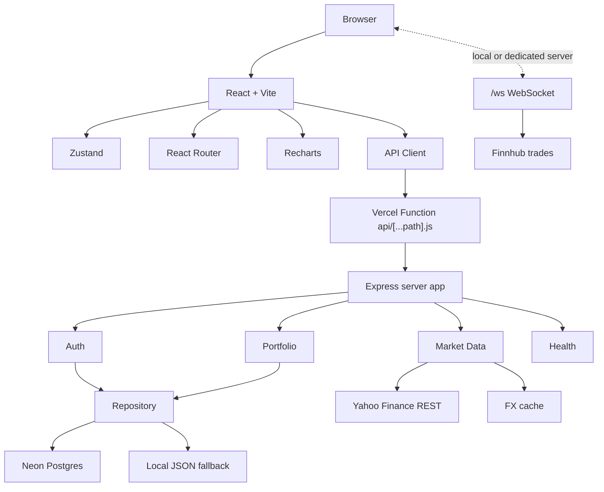
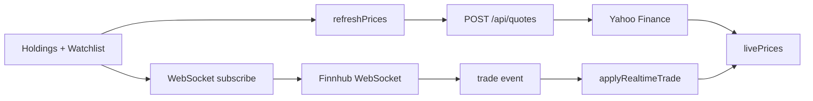
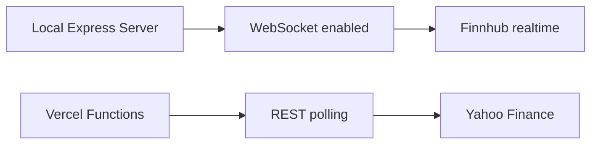

# Architecture

## Runtime

```mermaid
flowchart TB
  Browser["Browser"] --> Vite["React + Vite"]
  Vite --> Zustand["Zustand"]
  Vite --> Router["React Router"]
  Vite --> Charts["Recharts"]
  Vite --> Api["API Client"]

  Api --> Function["Vercel Function api/[...path].js"]
  Function --> Express["Express server app"]

  Express --> Auth["Auth"]
  Express --> Portfolio["Portfolio"]
  Express --> Market["Market Data"]
  Express --> Health["Health"]

  Auth --> Repo["Repository"]
  Portfolio --> Repo
  Repo --> Postgres["Neon Postgres"]
  Repo --> Json["Local JSON fallback"]

  Market --> Yahoo["Yahoo Finance REST"]
  Market --> Fx["FX cache"]

  Browser <-. local or dedicated server .-> Ws["/ws WebSocket"]
  Ws --> Finnhub["Finnhub trades"]
```

## Market Data

```mermaid
flowchart LR
  Holdings["Holdings + Watchlist"] --> Refresh["refreshPrices"]
  Refresh --> Quotes["POST /api/quotes"]
  Quotes --> Yahoo["Yahoo Finance"]
  Yahoo --> Store["livePrices"]

  Holdings --> Subscribe["WebSocket subscribe"]
  Subscribe --> Finnhub["Finnhub WebSocket"]
  Finnhub --> Trade["trade event"]
  Trade --> Apply["applyRealtimeTrade"]
  Apply --> Store
```

## Deployment Modes

```mermaid
flowchart LR
  Local["Local Express Server"] --> WsEnabled["WebSocket enabled"]
  WsEnabled --> Finnhub["Finnhub realtime"]

  Vercel["Vercel Functions"] --> RestOnly["REST polling"]
  RestOnly --> Yahoo["Yahoo Finance"]
```
